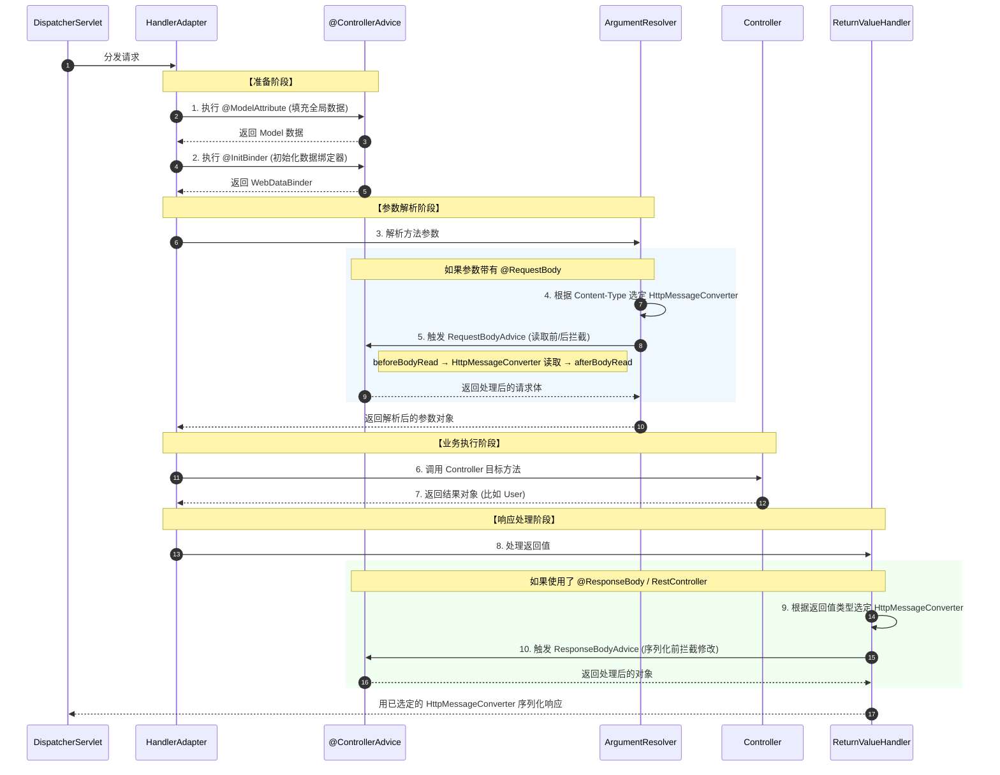

# @ControllerAdvice

`@ControllerAdvice` 是 Spring 提供的一个**控制器增强器**，用于给多个 Controller 统一添加功能。

被`@ControllerAdvice` 接口标注的类将被注册为Spring组件

## 源码

```java
@Target(ElementType.TYPE)
@Retention(RetentionPolicy.RUNTIME)
@Documented
@Component
public @interface ControllerAdvice {

	/**
	 * Alias for the {@link #basePackages} attribute.
	 * <p>Allows for more concise annotation declarations &mdash; for example,
	 * {@code @ControllerAdvice("org.my.pkg")} is equivalent to
	 * {@code @ControllerAdvice(basePackages = "org.my.pkg")}.
	 * @since 4.0
	 * @see #basePackages
	 */
	@AliasFor("basePackages")
	String[] value() default {};

	/**
	 * Array of base packages.
	 * <p>Controllers that belong to those base packages or sub-packages thereof
	 * will be included &mdash; for example,
	 * {@code @ControllerAdvice(basePackages = "org.my.pkg")} or
	 * {@code @ControllerAdvice(basePackages = {"org.my.pkg", "org.my.other.pkg"})}.
	 * <p>{@link #value} is an alias for this attribute, simply allowing for
	 * more concise use of the annotation.
	 * <p>Also consider using {@link #basePackageClasses} as a type-safe
	 * alternative to String-based package names.
	 * @since 4.0
	 */
	@AliasFor("value")
	String[] basePackages() default {};

	/**
	 * Type-safe alternative to {@link #basePackages} for specifying the packages
	 * in which to select controllers to be advised by the {@code @ControllerAdvice}
	 * annotated class.
	 * <p>Consider creating a special no-op marker class or interface in each package
	 * that serves no purpose other than being referenced by this attribute.
	 * @since 4.0
	 */
	Class<?>[] basePackageClasses() default {};

	/**
	 * Array of classes.
	 * <p>Controllers that are assignable to at least one of the given types
	 * will be advised by the {@code @ControllerAdvice} annotated class.
	 * @since 4.0
	 */
	Class<?>[] assignableTypes() default {};

	/**
	 * Array of annotation types.
	 * <p>Controllers that are annotated with at least one of the supplied annotation
	 * types will be advised by the {@code @ControllerAdvice} annotated class.
	 * <p>Consider creating a custom composed annotation or use a predefined one,
	 * like {@link RestController @RestController}.
	 * @since 4.0
	 */
	Class<? extends Annotation>[] annotations() default {};

}

```

- basePackages：`basePackages` 允许你指定一个或多个包名，只有这些包下的 Controller 抛出的异常或返回的数据，才会触发该 Advice。

## 执行节点




