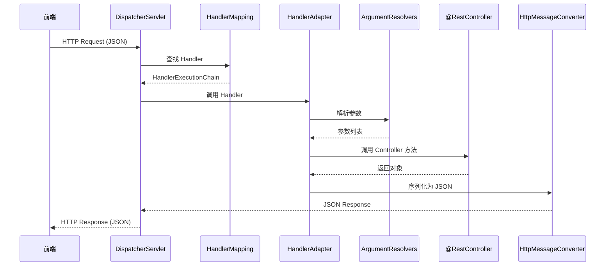

# 请求流转



## 1. DispatcherServlet

**职责**:

- 前端控制器，所有请求的入口
- 协调各组件完成请求处理

关键代码：

```java
protected void doDispatch(HttpServletRequest request, HttpServletResponse response) {
    // 1. 查找 Handler
    HandlerExecutionChain mappedHandler = getHandler(request);
    
    // 2. 获取 HandlerAdapter
    HandlerAdapter ha = getHandlerAdapter(mappedHandler.getHandler());
    
    // 3. 执行 Handler（包含参数解析）
    ModelAndView mv = ha.handle(request, response, mappedHandler.getHandler());
}
```

## 2. HandlerMapping

**实现类**: `RequestMappingHandlerMapping`

**职责**:

- 根据请求 URL 和 HTTP 方法查找对应的 Handler
- 维护 URL 到 Controller 方法的映射关系

**映射注册时机**:

- 应用启动时扫描 `@RequestMapping` 注解
- 构建 `RequestMappingInfo` 对象
- 存储到 `MappingRegistry` 中

## 3.  HandlerAdapter

**实现类**: `RequestMappingHandlerAdapter`

**职责**:

- 调用具体的 Handler 方法
- 协调参数解析和返回值处理

**关键方法**:

```java
public ModelAndView handle(HttpServletRequest request, 
                          HttpServletResponse response, 
                          Object handler) {
    // 1. 解析 Controller 方法的参数值。
    Object[] args = getMethodArgumentValues(request, response, handlerMethod);
    
    // 2. 调用方法
    Object returnValue = invokeForRequest(request, response, args);
    
    // 3. 处理返回值
    return handleReturnValue(returnValue, ...);
}
```

## 4. ArgumentResolver

**核心接口**: `HandlerMethodArgumentResolver`

**职责**:

根据 Controller 方法的参数列表，通过各种 `HandlerMethodArgumentResolver` 解析出真实参数，然后组装成 Object[]，最终用于反射调用 Controller 方法。

**支持判断**:

```java
public boolean supportsParameter(MethodParameter parameter) {
    return parameter.hasParameterAnnotation(RequestBody.class);
}
```

**核心解析流程**:

```java
// HandlerAdapter 中的参数解析逻辑
private Object[] getMethodArgumentValues(HttpServletRequest request,
                                         HttpServletResponse response,
                                         HandlerMethod handlerMethod) {
    MethodParameter[] parameters = handlerMethod.getMethodParameters();
    Object[] args = new Object[parameters.length];

    for (int i = 0; i < parameters.length; i++) {
        MethodParameter parameter = parameters[i];
        // 1. 找到支持该参数的 Resolver
        HandlerMethodArgumentResolver resolver = getArgumentResolver(parameter);
        // 2. 调用 resolveArgument 解析参数值
        args[i] = resolver.resolveArgument(parameter, mavContainer, webRequest, binderFactory);
    }
    return args;
}
```

| Controller参数写法    | 参数解析器                                 | 数据来源                 |
| --------------------- | ------------------------------------------ | ------------------------ |
| `@RequestParam`       | `RequestParamMethodArgumentResolver`       | URL查询参数 `?name=张三` |
| `@PathVariable`       | `PathVariableMethodArgumentResolver`       | URL路径 `/user/{id}`     |
| 无注解简单类型        | `RequestParamMethodArgumentResolver`       | URL查询参数              |
| 无注解对象类型        | `ServletModelAttributeMethodProcessor`     | URL参数封装对象          |
| `@ModelAttribute`     | `ServletModelAttributeMethodProcessor`     | URL参数封装对象          |
| `HttpServletRequest`  | `ServletRequestMethodArgumentResolver`     | Servlet请求对象          |
| `HttpServletResponse` | `ServletResponseMethodArgumentResolver`    | Servlet响应对象          |
| `@RequestHeader`      | `RequestHeaderMethodArgumentResolver`      | HTTP Header              |
| `@CookieValue`        | `ServletCookieValueMethodArgumentResolver` | Cookie                   |
| `@RequestBody`        | `RequestResponseBodyMethodProcessor`       | 请求体 JSON/XML          |

::: tip

`RequestResponseBodyMethodProcessor` **同时承担了“参数解析”和“返回值处理”两个职责**，而不仅仅是解析方法参数，所以 Spring 没有把它命名为 `MethodArgumentResolver`。

:::
