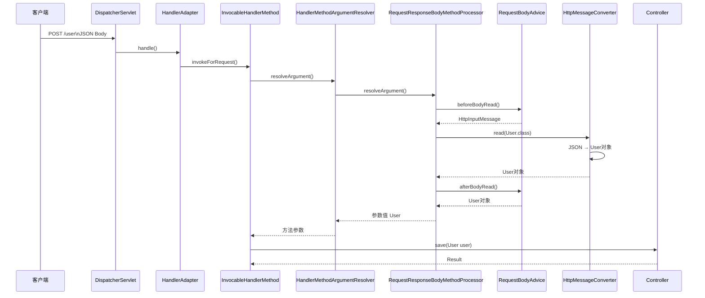
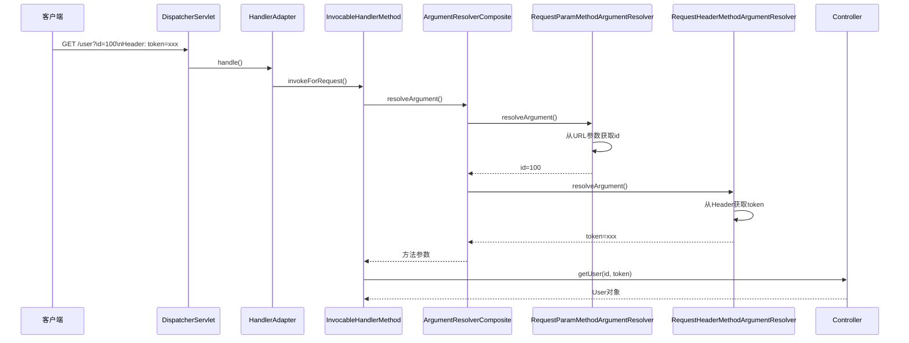

# 请求与响应流转

以一次典型的 POST 请求为例

## 0.解析Controller

在请求处理流程中，Controller 方法的**形参和返回值类型**是**提前根据反射解析好并缓存**的。

- 解析方法参数将根据Controller**形参类型**进行处理
- 处理方法返回值将根据Controller**返回值类型**进行处理

## 1.解析方法参数

```java
┌─────────────────────────────────────────────────────────────┐
│  1. 解析方法参数（入参）                                      │
│     ↓                                                       │
│     RequestResponseBodyMethodProcessor（处理 @RequestBody）   │
│     ↓                                                       │
│     ├─ RequestBodyAdvice.supports()     ← 判断是否拦截        │
│     ↓                                                       │
│     ├─ RequestBodyAdvice.beforeBodyRead()                   │
│     ↓                                                       │
│     ├─ 【反序列化】HttpMessageConverter.read()                   │
│     │      ↑ 这里！遍历匹配 Converter，调用 Jackson 反序列化   │
│     ↓                                                       │
│     └─ RequestBodyAdvice.afterBodyRead()                    │
│            ↑ 反序列化后的 Java 对象到这里                      │
└─────────────────────────────────────────────────────────────┘
```

1. **URL 参数解析 (`userId=100`)**： 

   Spring MVC 发现 Controller 方法上需要 `Long userId`。此时，**`Converter<String, Long>`** 出场，将字符串 `"100"` 转换为 Java 的 `100L`。

2. **请求体解析 (`@RequestBody`)**：

   当请求是JSON时，并且标注了`@RequestBody`，将使用`RequestResponseBodyMethodProcessor`解析参数。他包括：

   - 调用 RequestBodyAdvice

   - 选择并调用 MessageConverter.read()（反序列化）

   - 用 `ArgumentResolver` 完成参数绑定


## 2.Controller 方法执行

解析的参数将注入Controller的形参中

## 3.处理返回值

```java
┌─────────────────────────────────────────────────────────────┐
│  2. 返回值（出参）                                        │
│     ↓                                                       │
│     RequestResponseBodyMethodProcessor（处理 @ResponseBody）  │
│     ↓                                                       │
│     ├─ ResponseBodyAdvice.supports()    ← 判断是否拦截        │
│     ↓                                                       │
│     ├─ ResponseBodyAdvice.beforeBodyWrite(body, ...)        │
│     │      ↑ 此时 body 还是 Java 对象，在这里统一包装 Result   │
│     ↓                                                       │
│     ├─ 【序列化】HttpMessageConverter.write()                    │
│     │      ↑ 这里！遍历匹配 Converter，调用 Jackson 序列化      │
│     ↓                                                       │
│     └─ 写入 ServletOutputStream                             │
└─────────────────────────────────────────────────────────────┘
```

当响应标注了`@ResponseBody`时，将使用`RequestResponseBodyMethodProcessor`进行处理。他包括：

- 调用`ResponseBodyAdvice`
- 选择并调用 `MessageConverter.write()`（序列化）
- 写入 ServletOutputStream

## 异常流转


```
[ HTTP 请求 ]
      │
      ▼
┌──────────────────────────────────────────────┐
│  1. Filter 过滤器层 / Tomcat 容器层          │ ──> 只能靠 BasicErrorController 
└──────────────────────────────────────────────┘     或 Filter 内部自己 try-catch 响应
      │
      ▼ (进入 DispatcherServlet 核心大括号)
┌──────────────────────────────────────────────┐
│  2. Interceptor 拦截器层                     │ ──> 【可被 @ExceptionHandler 捕获】
└──────────────────────────────────────────────┘
      │
      ▼
┌──────────────────────────────────────────────┐
│  3. 参数解析 / 校验层 (Validator/Converter)   │ ──> 【可被 @ExceptionHandler 捕获】
└──────────────────────────────────────────────┘
      │
      ▼
┌──────────────────────────────────────────────┐
│  4. Controller 目标方法                      │ ──> 【可被 @ExceptionHandler 捕获】
└──────────────────────────────────────────────┘
```







