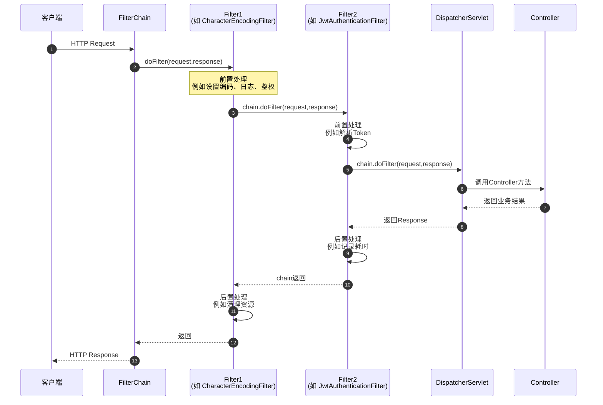

# 过滤器

虽然 Spring 提供了拦截器（Interceptor）和 AOP（切面），但 Filter 依托于 Servlet 容器，处于请求的最外层。这种特殊的地理位置，决定了它在处理**全局性、系统级、与业务逻辑解耦**的场景时，具有不可替代的地位。




通常，在一个标准的 Spring Boot 项目中，以下几个核心场景几乎必然会用到 Filter：

## 认证与授权

这是 Filter 最重磅的舞台。著名的 **Spring Security** 核心原理就是一套由十几个 Filter 组成的过滤器链（FilterChain）。

如果你用过 **Spring Security** 或 **Shiro**，你会发现它们无一例外都是基于 **Filter 链（Filter Chain）** 实现的。

Spring Security 的核心就是 `SecurityFilterChain`。既然官方和主流框架都把认证放在 Filter 层，那么遵循这个规范，将 JWT/Token 的解析和上下文构建，放在 Filter 中就是最顺理成章的选择。

::: tip

拦截器也可以去处理Token。这并不是一个非黑即白的绝对选择，而是取决于你的**系统架构、安全框架**以及**对性能的要求**。

:::


## 跨域处理

虽然 Spring 提供了 `@CrossOrigin` 注解，但在前后端分离（如 Vue + Java）的架构中，最彻底、最不容易出 Bug 的跨域解决方案依然是在 Filter 层配置 `CorsFilter`。

**原因：** 跨域的 `OPTIONS` 预检请求需要尽早被响应。如果在 Filter 层就允许跨域并返回 200，请求就不会白白走到后面的业务代码里。


## 日志记录

记录每一个进入系统的 HTTP 请求的详细信息（URL、请求方法、客户端 IP、执行耗时等）。

**原因：** 在 Filter 中可以通过 `System.currentTimeMillis()` 轻松计算出整个 HTTP 请求从进来至出去的总耗时，这是最精准的系统监控指标。

## 安全防御

- **XSS 过滤：** 通过 Filter 拦截请求，重写 `HttpServletRequest`，对所有输入的参数进行 HTML 转义，防止 XSS 注入攻击。

- **请求体可重复读取：** 默认的 `HttpServletRequest` 的输入流（InputStream）只能读取一次。在 Filter 中可以使用 `ContentCachingRequestWrapper` 对请求体进行缓存，这样后面的 Interceptor 或 Controller 就能重复读取 Body 数据（这在打印请求参数日志时非常有用）。


## 为什么不全用拦截器

| **特性**     | **Filter (过滤器)**                                        | **Interceptor (拦截器)**                                     |
| ------------ | ---------------------------------------------------------- | ------------------------------------------------------------ |
| **所属框架** | Servlet 容器（Tomcat 级别）                                | Spring MVC 框架级别                                          |
| **执行时机** | 在进入 `DispatcherServlet` **之前**和**之后**              | 在进入 `Controller` **之前**和**之后**                       |
| **核心能力** | **可以操纵 Request / Response 对象**（如包装、替换输入流） | 无法替换 Request/Response，但能获取到目标 Controller 的方法信息（Method） |
| **适用场景** | 权限控制、跨域、XSS 过滤、全局性能监控                     | 业务级别的Token解析、防重复提交、单接口权限粒度控制          |


## 原理

```java
public class ApplicationFilterChain implements FilterChain {
    private Filter[] filters; // 存放所有的 Filter (A, B, C)
    private int pos = 0;      // 当前执行到的 Filter 下标
    private Servlet targetServlet; // 最终的目标 Servlet

    @Override
    public void doFilter(ServletRequest request, ServletResponse response) {
        if (pos < filters.length) {
            // 取出当前 Filter，并将指针后移
            Filter filter = filters[pos++]; 
            
            // 传入当前 chain 对象（this），以便 Filter 内部能继续调用 doFilter
            filter.doFilter(request, response, this); 
        } else {
            // 所有 Filter 执行完毕（执行完最后一个Filter的doFilter），调用最终的 Servlet 业务逻辑
            targetServlet.service(request, response);
        }
    }
}
```

当你调用 `chain.doFilter()` 时，当前 Filter 的方法并没有执行完，它只是**暂停**在这一行，并将chain控制权交给了下一个 Filter。

```java
@Component
public class MyFilter implements Filter {

    @Override
    public void doFilter(ServletRequest request,
                         ServletResponse response,
                         FilterChain chain)
            throws IOException, ServletException {

        System.out.println("Filter 前置处理");

        chain.doFilter(request, response);

        System.out.println("Filter 后置处理");
    }
}

```

**对于单次 HTTP 请求，整个过滤链上的所有 Filter 确实是共用同一个 `FilterChain` 对象**。

但需要特别注意的是：**这个 `FilterChain` 对象的生命周期是“请求级别”的，而不是全局唯一的。**

在处理某一个特定的 HTTP 请求时，Tomcat（或其他 Servlet 容器）会为这个请求专门创建一个 `ApplicationFilterChain` 实例。

正是因为共用了同一个 `chain` 对象，它内部的计数器（如 `pos` 指针）才能在每一次调用 `doFilter` 时累加（`pos++`），从而精准地知道下一步该执行哪一个 Filter，而不会陷入死循环。

::: tip  为什么不能全局共用一个 FilterChain？

既然大家都共用，那为什么不把 `FilterChain` 做成单例（Singleton），让所有的 HTTP 请求都共用同一个呢？

为了保证线程安全和状态隔离。

- **多线程并发**：Web 服务器同时会处理成百上千个并发请求。每个请求匹配到的 Filter 列表可能不同（比如有些 URL 需要安全拦截，有些不需要）。

- **内部状态冲突**：`FilterChain` 内部保存了 `pos`（当前执行到第几个 Filter 的指针）。如果全局共用一个对象，多个并发请求同时修改同一个 `pos` 指针，就会导致严重的线程安全问题（请求 A 的进度影响了请求 B，导致 Filter 漏执行或越界）。

因此，**每一个 HTTP 请求都会拥有一个自己独立的 `FilterChain` 实例**，它伴随着请求的创建而创建，随着请求的结束而被销毁（或被容器回收进对象池中复用）。而在该请求的内部，所有的 Filter 之间是共用这同一个实例的。

:::


## 深入理解doFilter

在 Filter 中不调用 `chain.doFilter()` 的唯一作用就是：**强行拦截请求，提前结束后续链路。**

- 请求会被**永久阻断**在当前 Filter。后续的任何 Filter，以及你最终的 Controller（Servlet）业务逻辑，**通通不会被执行**。
- 当前 Filter 成了请求的“终点站”。你必须在当前 Filter 里**自己动手**往 `response` 里写数据（比如返回 401 状态码、提示 “Token 无效”的 JSON 等）。如果你什么都不写，客户端就会收到一个 200 的空页面。

- 程序在当前 Filter 处直接“调头”，不再往下走，而是沿着方法调用栈**原路返回**，依次执行前面那些已经放行的 Filter 的**后置代码**（即它们 `chain.doFilter()` 后面的代码）。
