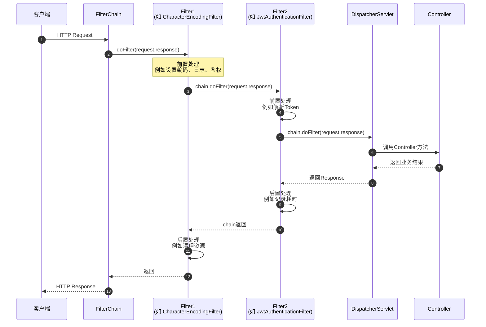

# Filter原理

## 流程




## 原理

```java
public class ApplicationFilterChain implements FilterChain {
    private Filter[] filters; // 存放所有的 Filter (A, B, C)
    private int pos = 0;      // 当前执行到的 Filter 下标
    private Servlet targetServlet; // 最终的目标 Servlet

    @Override
    public void doFilter(ServletRequest request, ServletResponse response) {
        if (pos < filters.length) {
            // 取出当前 Filter，并将指针后移
            Filter filter = filters[pos++]; 
            
            // 传入当前 chain 对象（this），以便 Filter 内部能继续调用 doFilter
            filter.doFilter(request, response, this); 
        } else {
            // 所有 Filter 执行完毕（执行完最后一个Filter的doFilter），调用最终的 Servlet 业务逻辑
            targetServlet.service(request, response);
        }
    }
}
```

当你调用 `chain.doFilter()` 时，当前 Filter 的方法并没有执行完，它只是**暂停**在这一行，并将chain控制权交给了下一个 Filter。

```java
@Component
public class MyFilter implements Filter {

    @Override
    public void doFilter(ServletRequest request,
                         ServletResponse response,
                         FilterChain chain)
            throws IOException, ServletException {

        System.out.println("Filter 前置处理");

        chain.doFilter(request, response);

        System.out.println("Filter 后置处理");
    }
}

```

**对于单次 HTTP 请求，整个过滤链上的所有 Filter 确实是共用同一个 `FilterChain` 对象**。

但需要特别注意的是：**这个 `FilterChain` 对象的生命周期是“请求级别”的，而不是全局唯一的。**

在处理某一个特定的 HTTP 请求时，Tomcat（或其他 Servlet 容器）会为这个请求专门创建一个 `ApplicationFilterChain` 实例。

正是因为共用了同一个 `chain` 对象，它内部的计数器（如 `pos` 指针）才能在每一次调用 `doFilter` 时累加（`pos++`），从而精准地知道下一步该执行哪一个 Filter，而不会陷入死循环。

::: tip  为什么不能全局共用一个 FilterChain？

既然大家都共用，那为什么不把 `FilterChain` 做成单例（Singleton），让所有的 HTTP 请求都共用同一个呢？

为了保证线程安全和状态隔离。

- **多线程并发**：Web 服务器同时会处理成百上千个并发请求。每个请求匹配到的 Filter 列表可能不同（比如有些 URL 需要安全拦截，有些不需要）。

- **内部状态冲突**：`FilterChain` 内部保存了 `pos`（当前执行到第几个 Filter 的指针）。如果全局共用一个对象，多个并发请求同时修改同一个 `pos` 指针，就会导致严重的线程安全问题（请求 A 的进度影响了请求 B，导致 Filter 漏执行或越界）。

因此，**每一个 HTTP 请求都会拥有一个自己独立的 `FilterChain` 实例**，它伴随着请求的创建而创建，随着请求的结束而被销毁（或被容器回收进对象池中复用）。而在该请求的内部，所有的 Filter 之间是共用这同一个实例的。

:::


## 深入理解doFilter

在 Filter 中不调用 `chain.doFilter()` 的唯一作用就是：**强行拦截请求，提前结束后续链路。**

- 请求会被**永久阻断**在当前 Filter。后续的任何 Filter，以及你最终的 Controller（Servlet）业务逻辑，**通通不会被执行**。
- 当前 Filter 成了请求的“终点站”。你必须在当前 Filter 里**自己动手**往 `response` 里写数据（比如返回 401 状态码、提示 “Token 无效”的 JSON 等）。如果你什么都不写，客户端就会收到一个 200 的空页面。

- 程序在当前 Filter 处直接“调头”，不再往下走，而是沿着方法调用栈**原路返回**，依次执行前面那些已经放行的 Filter 的**后置代码**（即它们 `chain.doFilter()` 后面的代码）。

## Example

```java
import jakarta.servlet.*;
import jakarta.servlet.http.HttpServletRequest;
import jakarta.servlet.http.HttpServletResponse;
import java.io.IOException;

public class MyFilter implements Filter {

    @Override
    public void init(FilterConfig filterConfig) throws ServletException {
        // 过滤器初始化时调用，可用于加载配置参数
        String encoding = filterConfig.getInitParameter("encoding");
        System.out.println("Filter 初始化，编码：" + encoding);
    }

    @Override
    public void doFilter(ServletRequest servletRequest, ServletResponse servletResponse, FilterChain chain)
            throws IOException, ServletException {
        HttpServletRequest request = (HttpServletRequest) servletRequest;
        HttpServletResponse response = (HttpServletResponse) servletResponse;

        // 前置处理：记录请求开始时间
        long start = System.currentTimeMillis();
        System.out.println("请求进入：" + request.getMethod() + " " + request.getRequestURI());

        // 放行，执行下一个过滤器或目标资源
        chain.doFilter(request, response);

        // 后置处理：计算耗时
        long duration = System.currentTimeMillis() - start;
        System.out.println("请求完成，耗时：" + duration + "ms");
    }

    @Override
    public void destroy() {
        // 过滤器销毁时调用，可用于释放资源
        System.out.println("Filter 已销毁");
    }
}
```

