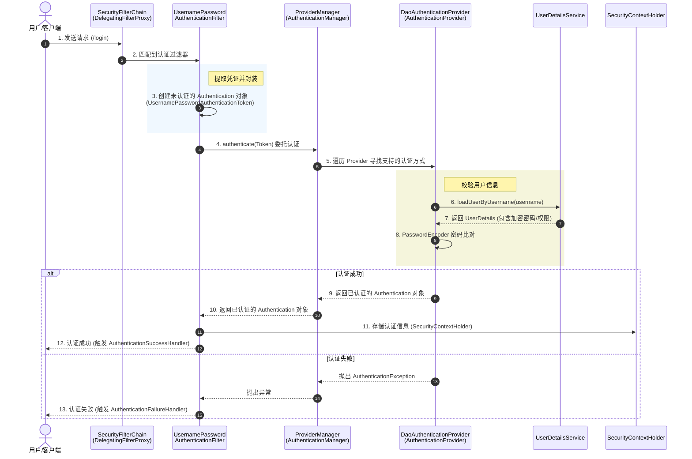
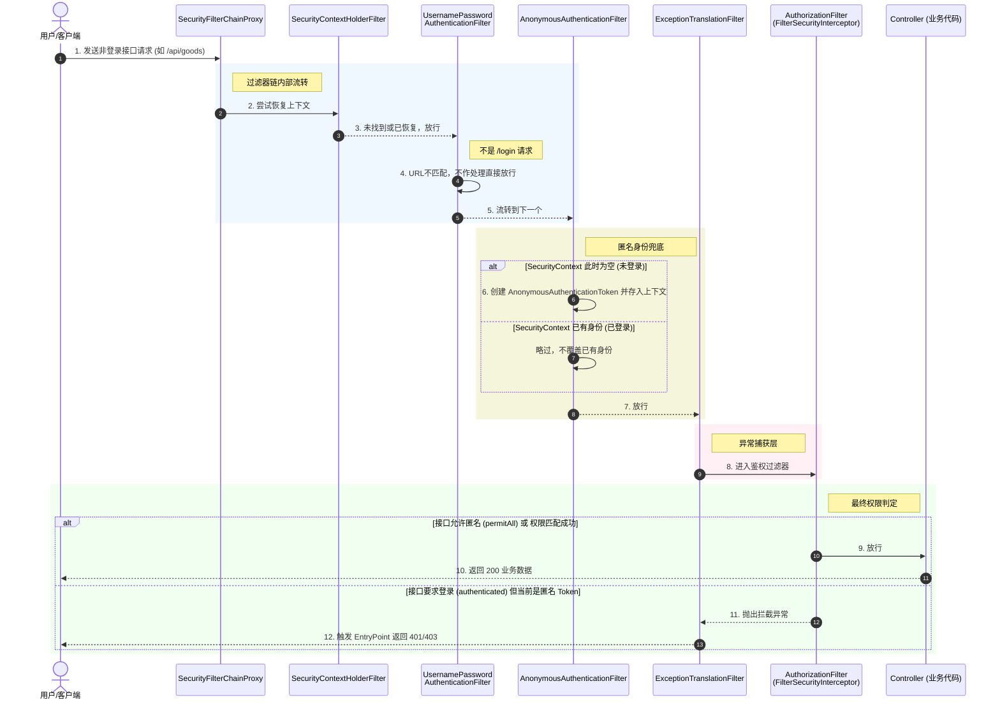

# 完整流程

## 登录接口

请求带着明文的 username和 password 进入后端后，会依次经历以下 4 个核心组件：

### 1.UsernamePasswordAuthenticationFilter

> 拦截登录表单

它拦截到 `/login` 请求，把请求体或表单里的用户名和密码捞出来，打包成一个未认证的令牌对象：`UsernamePasswordAuthenticationToken(username, password)`。然后把这个令牌递给下一关。

### 2.ProviderManager

>  认证协调者：它是 AuthenticationManager接口的默认实现类，自己不亲自干活，而是负责“找人干活”。

### 3.DaoAuthenticationProvider

> 真正的核心查库+比对者：负责“调出档案”并“比对指纹”。这也是我们自定义接入的最核心区域。

1. **查库**：它会调用你写的 `MyCustomUserDetailsService.loadUserByUsername(username)`。
2. **获取UserDetails**：你的 Service 去数据库查到了正确的用户名和**加密后的密码密文**，并包装成 `UserDetails` 返回给 Provider。
3. **核对密码**：Provider 调用 `PasswordEncoder.matches(用户输入的明文密码, 数据库的密文密码)`。

### 4.认证结果处理

- **比对失败**：如果密码对不上，或者用户不存在，直接抛出 `BadCredentialsException`，流程中断。
- **比对成功**：Provider 会重新打包一个“已认证状态”的 `UsernamePasswordAuthenticationToken`（里面标记了 `authenticated = true`），一路返回并存入 `SecurityContextHolder`（内存安全上下文），代表该用户在当前请求中已登录成功。

## 非登录接口

对于**非登录接口**（即普通受保护的业务接口，如 `/api/user/profile`），Spring Security 的核心任务不再是“辨别你是谁”（认证），而是“检查你是否已经登录”**以及**“你是否有权限访问”（鉴权）

### 1.SecurityContextHolderFilter

> 上下文恢复

- 哪怕不是登录接口，Spring Security 也会在前端请求进来时，尝试去“相认”。
- 如果是 **Session 模式**，它会从 `HttpSession` 中读取之前登录存入的认证信息。
- 如果是 **JWT 模式**，这里通常是你自定义的 `JwtAuthenticationFilter`，负责拦截请求、解析 Header 中的 Token、验证有效性，并把解析出的用户信息再次封装塞进 `SecurityContextHolder`。

### 2.UsernamePasswordAuthenticationFilter

发现不是登录请求，**直接放行**。

### 3.AnonymousAuthenticationFilter

只有前面所有认证过滤器都没认证成功时才会执行。

发现没有认证信息，将当前用户标记为 **Anonymous（匿名）**，继续放行。

### 4.ExceptionTranslationFilter

> 异常处理：代码结构上是一个 `try-catch` 块，它**先放行**让请求走下一个过滤器，并等待捕获异常。

- 如果在第 5 步发现用户**没登录**（Context 为空），会抛出 `AuthenticationException`，系统默认或自定义的 `AuthenticationEntryPoint` 会返回 **401 状态码**。
- 如果用户**登录了但权限不够**，会抛出 `AccessDeniedException`，由 `AccessDeniedHandler` 返回 **403 状态码**。

### 5.FilterSecurityInterceptor / AuthorizationFilter

> 核心鉴权拦截器,它是过滤器链的**最后一关**。

它会干两件事：

- **检查是否允许匿名访问**：如果该接口配置了 `.permitAll()`，则直接放行。
- **检查权限是否匹配**：如果配置了 `.authenticated()` 或 `@PreAuthorize("hasAuthority('USER')")`，它会去 `SecurityContextHolder` 里拿出第 3 步存入的权限列表，比对当前用户是否拥有该权限。

