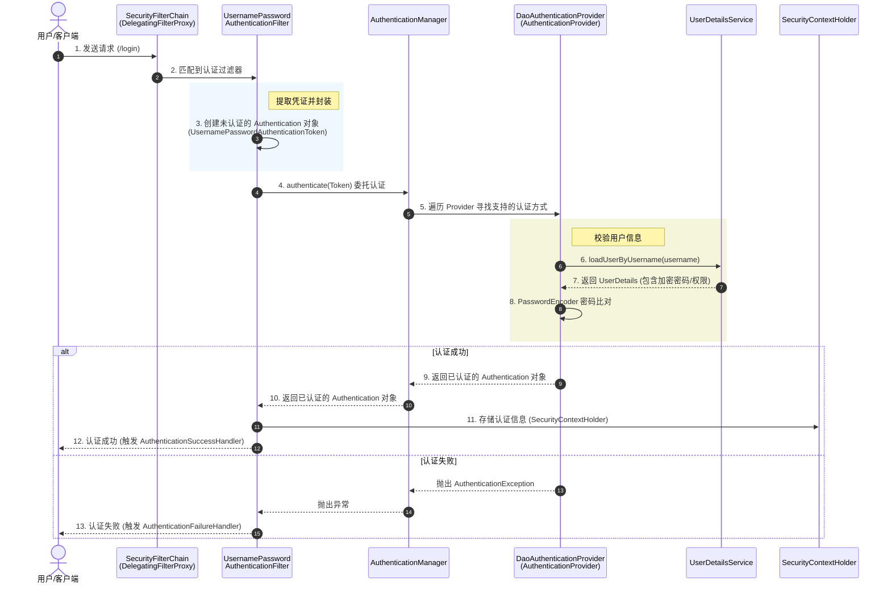

# 认证（Session）

Session 认证是 Spring Security 最传统的一种认证方式

> 第一次登录时验证用户名密码，并把认证结果保存到服务器 Session；之后请求只需要携带 SessionId，服务器恢复用户身份。

`UsernamePasswordAuthenticationFilter` 自己不会直接保存 Session，它通过认证成功流程保存 SecurityContext（具体取决于配置）。

当用户请求登录接口时，请求带着明文的 username和 password 进入后端后，会依次经历以下 4 个核心组件：

## 1.UsernamePasswordAuthenticationFilter

> 拦截登录表单

它拦截到 `/login` 请求，把请求体或表单里的用户名和密码捞出来，打包成一个未认证的令牌对象：`UsernamePasswordAuthenticationToken(username, password)`。然后把这个令牌递给下一组件。

## 2.AuthenticationManager

>  认证协调者，自己不亲自干活，而是负责“找人干活”。

## 3.DaoAuthenticationProvider

> 根据用户名查询用户信息，然后使用 PasswordEncoder 校验密码。

## 4.认证结果处理

- **比对失败**：如果密码对不上，直接抛出异常，并由`UsernamePasswordAuthenticationFilter`处理异常，流程中断。
- **比对成功**：Provider 会重新打包一个“已认证状态”的 `UsernamePasswordAuthenticationToken`（里面标记了 `authenticated = true`），一路返回并存入 `SecurityContextHolder`（Security上下文），代表该用户在当前请求中已登录成功。
