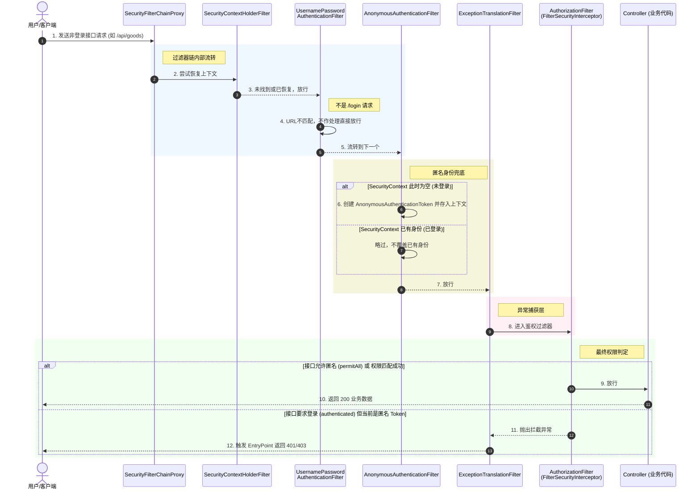

# 过滤器链

对于**非登录接口**（即普通受保护的业务接口，如 `/api/user/profile`），Spring Security 的核心任务不再是“辨别你是谁”（认证），而是“检查你是否已经登录”**以及**“你是否有权限访问”（鉴权）

### 1.SecurityContextHolderFilter

> 负责 **管理 SecurityContext 的生命周期**

- 哪怕不是登录接口，Spring Security 也会在前端请求进来时，尝试去“相认”。
- 如果是 **Session 模式**，它会从 `HttpSession` 中读取之前登录存入的认证信息。
- 如果是 **JWT 模式**，放行至 `JwtAuthenticationFilter`解析出的用户信息封装至 `SecurityContextHolder`。

### 2.UsernamePasswordAuthenticationFilter

发现不是登录请求，**直接放行**。

### 3.AnonymousAuthenticationFilter

只有前面所有认证过滤器都没认证成功时才会执行。

发现没有认证信息，将当前用户标记为 **Anonymous（匿名）**，继续放行。

### 4.ExceptionTranslationFilter

> 异常处理：代码结构上是一个 `try-catch` 块，它**先放行**让请求走下一个过滤器，并等待捕获异常。

- 如果在第 5 步发现用户**没登录**（Context 为空），会抛出 `AuthenticationException`，系统默认或自定义的 `AuthenticationEntryPoint` 会返回 **401 状态码**。
- 如果用户**登录了但权限不够**，会抛出 `AccessDeniedException`，由 `AccessDeniedHandler` 返回 **403 状态码**。

### 5.FilterSecurityInterceptor / AuthorizationFilter

> 核心鉴权拦截器,它是过滤器链的**最后一关**。

它会干两件事：

- **检查是否允许匿名访问**：如果该接口配置了 `.permitAll()`，则直接放行。
- **检查权限是否匹配**：如果配置了 `.authenticated()` 或 `@PreAuthorize("hasAuthority('USER')")`，它会去 `SecurityContextHolder` 里拿出第 3 步存入的权限列表，比对当前用户是否拥有该权限。

