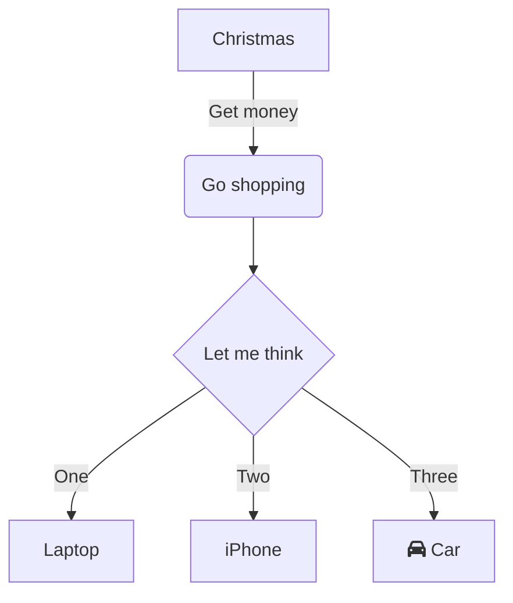

# 快速开始

## 项目结构

使用 `create-rspress` 创建项目后，你将获得以下项目结构：

- `docs/` — 文档源目录，通过 `rspress.config.ts` 中的 `root` 配置。
- `docs/_nav.json` — 导航栏配置。
- `docs/guide/_meta.json` — 指南部分的侧边栏配置。
- `docs/public/` — 静态资源目录。
- `theme/` — 可选的自定义主题目录，选择自定义主题脚手架时会生成。
- `rspress.config.ts` — Rspress 配置文件。

## 开发

启动本地开发服务器：

```bash
npm run dev
```

:::tip

你可以使用 `--port` 或 `--host` 指定端口号或主机，例如 `rspress dev --port 8080 --host 0.0.0.0`。

:::

## 生产构建

构建生产版本的站点：

```bash
npm run build
```

默认情况下，Rspress 会输出到 `doc_build` 目录。

## 预览

在本地预览生产构建：

```bash
npm run preview
```

## 下一步

- 学习如何在文档中使用 [MDX 和 React 组件](/guide/use-mdx/components)。
- 了解[代码块](/guide/use-mdx/code-blocks/)的语法高亮和行高亮。
- 了解[自定义容器](/guide/use-mdx/container)用于提示、警告等。
- 探索完整的 [Rspress 文档](https://rspress.rs/)了解更多高级功能。




